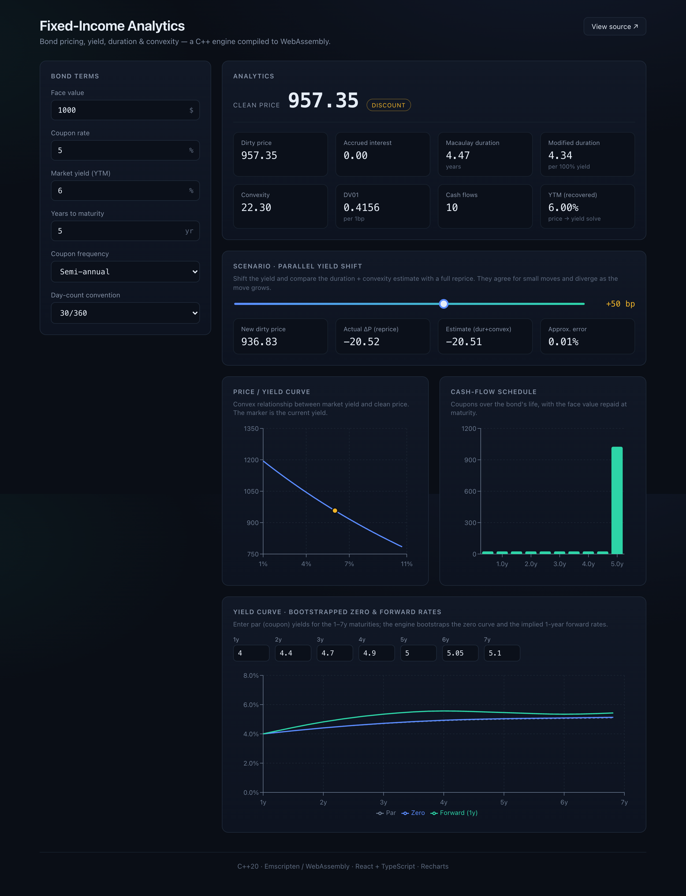
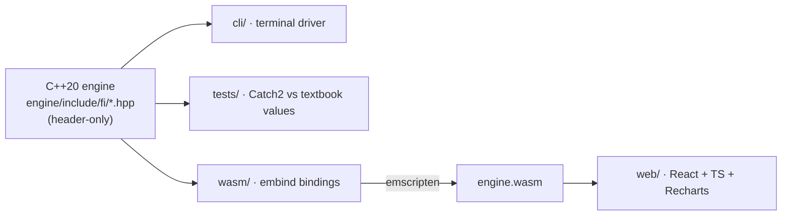

# cpp-fixed-income-analytics

[](https://github.com/M47H13UK/cpp-fixed-income-analytics/actions/workflows/ci.yml)
[](LICENSE)
[](CMakeLists.txt)
[](wasm/bindings.cpp)

A fixed-income analytics engine written in **C++20**, compiled to **WebAssembly**, and
driven by a **React + TypeScript** front-end. It prices fixed-rate coupon bonds and
computes yield to maturity, accrued
interest, duration, convexity, and DV01, then bootstraps a zero curve from par yields.

[Live demo](https://m47h13uk.github.io/cpp-fixed-income-analytics/)



---

## Background

This started as a first-year **finance-minor** homework exercise: a single C++ program that
plugged numbers into the bond-price formula. The formula is real but trivial on its own, so I
expanded it into an analytics engine. One C++ core, used three ways: an interactive CLI, a
unit-test suite checked against textbook values, and a browser UI that runs the *same*
compiled C++ through WebAssembly, with no logic copied into JavaScript.

## What it computes

| Area | Detail |
|------|--------|
| **Pricing** | Clean & dirty price, accrued interest (street / ISMA convention) |
| **Yield** | Yield to maturity by Newton-Raphson with a bisection fallback |
| **Risk** | Macaulay & modified duration, convexity, DV01 |
| **Day counts** | 30/360, ACT/360, ACT/365F, ACT/ACT (ISDA) |
| **Term structure** | Zero-curve bootstrap from par yields, spot/forward rates, price-off-curve |
| **Scenario** | Parallel yield shift: duration + convexity estimate vs a full reprice |

Cash flows are discounted **individually** rather than through the closed-form annuity, so a
0% yield is well defined. The original calculator divided by the rate and broke right there.

## Architecture



The engine is header-only and dependency-free, so the same translation units compile
natively (CLI, tests) and to `wasm32` (browser). The binding layer is a thin facade
(`analytics.hpp`) exposing flat, primitive-typed functions to JavaScript.

## The math

A bond's price is the present value of its coupon stream plus the present value of the
redeemed face value:

$$
P = \sum_{i=1}^{n} \frac{C}{\left(1 + \tfrac{y}{f}\right)^{t_i}} + \frac{F}{\left(1 + \tfrac{y}{f}\right)^{t_n}}
$$

where $C$ is the coupon per period, $y$ the annual yield, $f$ the coupon frequency, $F$
the face value, and $t_i$ the time to each cash flow in periods. Interest-rate risk is
summarised by **Macaulay duration** (the PV-weighted average time to cash flow) and
**convexity** (the curvature of the price/yield relationship):

$$
D_{\text{mac}} = \frac{1}{P}\sum_{i} t_i^{\,\text{yrs}} \cdot \text{PV}_i,
\qquad
D_{\text{mod}} = \frac{D_{\text{mac}}}{1 + y/f}
$$

The price response to a yield move $\Delta y$ is then approximated by

$$
\frac{\Delta P}{P} \approx -D_{\text{mod}}\,\Delta y + \tfrac{1}{2}\,\text{Convexity}\cdot \Delta y^2,
$$

which the **Scenario** panel checks live against a full reprice.

## Build & run

### C++ engine, CLI and tests

Requires CMake ≥ 3.20 and a C++20 compiler.

```bash
cmake -S . -B build -DCMAKE_BUILD_TYPE=Release
cmake --build build -j
ctest --test-dir build --output-on-failure   # runs the unit tests
./build/fi_cli                                # interactive calculator
```

### Web app

Requires [Emscripten](https://emscripten.org/) (`emcc` on `PATH`) and Node ≥ 18.

```bash
cd web
npm install
npm run build      # compiles C++ → WASM, type-checks, bundles with Vite
npm run preview    # serves the production build locally
# or: npm run dev   for the live-reload dev server
```

## Project layout

```text
engine/include/fi/   header-only C++ engine
  date.hpp           lightweight civil date + serial day number
  daycount.hpp       day-count conventions
  bond.hpp           bond definition + cash-flow schedule
  yield.hpp          pricing, accrued interest, YTM solver
  risk.hpp           duration, convexity, DV01
  curve.hpp          zero curve: bootstrap, spot/forward, price-off-curve
  analytics.hpp      facade bundling every metric (used by the bindings)
cli/main.cpp         interactive terminal driver
tests/               Catch2 unit tests
wasm/bindings.cpp    embind exports to JavaScript
web/                 React + TypeScript + Recharts front-end
docs/ROADMAP.md      phased build plan and decisions log
```

## Validated against textbook values

The test suite checks known results: a 5-year 5% bond yielding 6% prices to **957.876**
(annual) or **957.35** (semi-annual), and a 5-year zero to **747.258**. It also runs property
checks: par bonds price at par, YTM round-trips back to the price, and analytic duration and
convexity agree with numerical bumps.

## Roadmap

See [`docs/ROADMAP.md`](docs/ROADMAP.md). Planned extensions: option pricing
(Black-Scholes + Greeks + implied vol), callable bonds (yield-to-worst, OAS), and
key-rate durations.

## License

[MIT](LICENSE)
